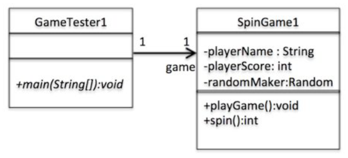
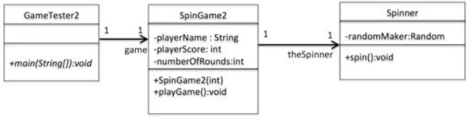
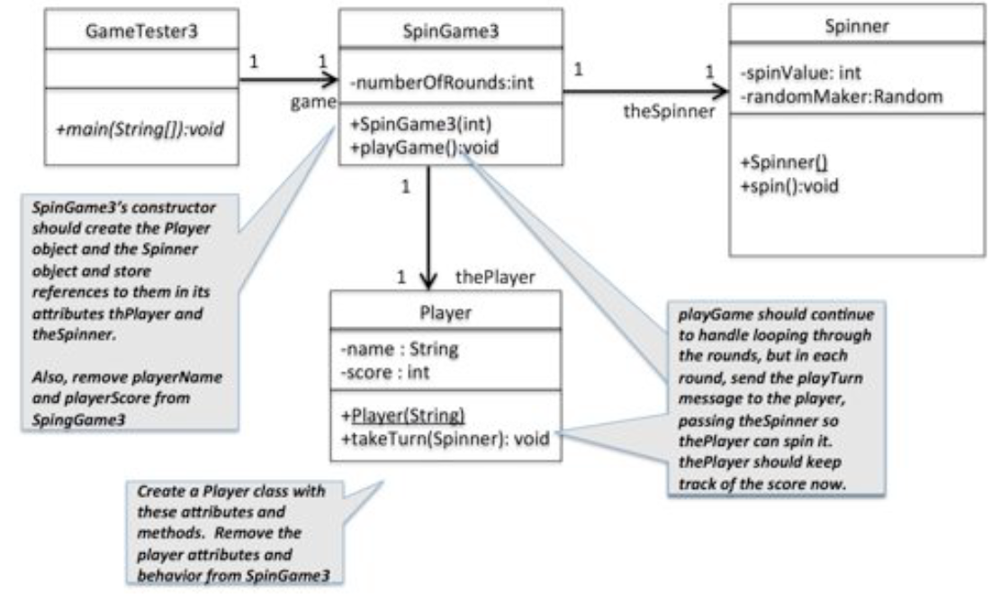
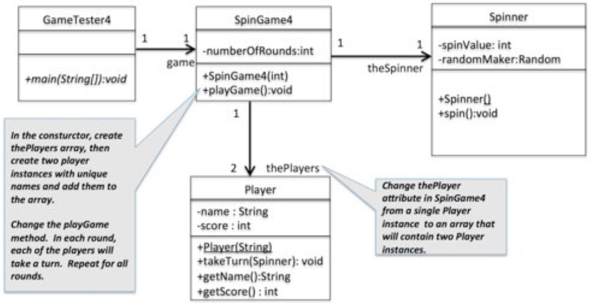

# lab-6

The objective of lab-6 is to create a new variation of the Spinner game you created in lab-5 as an object-oriented solution.
To aid your learning, you will be asked to create four incremental versions of the game.
As you move from version to version, some of the classes will be copied and renamed, while others will remain intact to be reused by multiple versions of your game.
This is intended to demonstrate reuse of these components, a key benefit of object-oriented programming.

## Spin Game Version 1

In version 1, you will create the game in a class called `SpinGame1` which does not have a main method. Create another class classed `GameTester1` with a
main method that includes the following code:

```java
  public static void main(String[] args) {
    SpinGame1 game = new SpinGame1();
    sg.playGame();
  }
```

Using the following UML model as a guide, create the `SpinGame1` class with the three attributes and two methods shown in the model below.
Set the `playerName` to a value of your choice and initialize the `playScore` to zero.
Also create a `Random` instance to be used by the spin method.



The purpose of each method in SpinGame1 is:

- playGame(): Run 5 rounds of the game. In each round, spin the spinner repeatedly until a 5 is spun. Count the number of spins until the 5 is spun, then add that value to the `playerScore`.
- spin(): Use the instance of `Random` named `randomMaker` to generate and return a random number from 1 to 0. |

Sample Run:

```
ROUND 1
6 1 3 5
Round 1 over. Fred's score is now 3
ROUND 2
10 10 2 9 10 4 7 10 3 1 9 10 3 10 8 4 5
Round 2 over. Fred's score is now 19
ROUND 3
6 1 4 3 3 9 1 3 3 2 10 4 8 3 2 10 5
Round 3 over. Fred's score is now 35
ROUND 4
3 2 10 3 7 1 5
Round 4 over. Fred's score is now 41
ROUND 5
5
Round 5 over. Fred's score is now 41
```

## Spin Game Version 2

In this version, start by making a copy of SpinGame1 and name it `SpinGame2`.
The spinning functionality in `SpinGame2` should be moved to a new component called `Spinner`.
Using the following UML model as a guide, create a new class called `Spinner` with the attribute `randomMaker`.



Also:

1. You should remove the randomMaker attribute from `SpinGame2`, since it will now only be used by the `Spinner` object.
2. Move the `spin()` method to the new `Spinner` class and have it return the random number it generates.
3. Add a constructor to `SpinGame2` that accepts an int parameter that will be saved in its new instance variable `numberOfRounds`.
4. In the `SpinGame2` constructor, also create an instance of `Spinner` and store it in its attribute `theSpinner`.
5. Change the `playGame` method in `SpinGame2` to use the value of `numberOfRounds` to control the loop that executes the number of rounds.
   Also in playGame, now use the `Spinner` object you created and send it the `spin()` message to get a valid spin value.
6. Finally, create a `GameTester2` class with a main method that prompts the user for a number of rounds,
   creates an instance of SpinGame2 with the number of rounds as the constructor's parameter, then sends it the `playGame()` message:

```java
import java.util.Scanner;

public class GameTester2 {
  public static void main(String[] args) {
    Scanner s = new Scanner(System.in);

    System.out.print("Enter number of rounds to play: ");
    int x = s.nextInt();

    SpinGame2 sg = new SpinGame2(x);
    sg.playGame();
  }
}
```

Sample Run:

```
Enter number of rounds to play: 3
-------------------------------------------
ROUND 1
Fred spins: 1 3 9 1 3 9 10 3 2 5
Fred's score is now 9
-------------------------------------------
ROUND 2
Fred spins: 1 4 6 2 7 10 7 6 3 1 6 1 8 6 8 7 3 9 2 1 2 9 9 7 4 4 8 7 9 3 2 7 10 8 6 8 10 9 8 3 9 7 9 7 3 9 6 10 1 7 4 1 5
Fred's score is now 61
-------------------------------------------
ROUND 3
Fred spins: 6 10 6 1 3 5
Fred's score is now 6
```

## Spin Game Version 3

In this version, start by making a copy of `SpinGame2` and name it `SpinGame3`.
The Player functionality in `SpinGame2` should be moved to a new component called `Player`.
Using the following UML model as a guide, create a new class called `Player` with the attributes `name` and `score`:



Also:

1. Create a constructor in `Player` that accepts a String parameter.
   Use the contents of that String to set the value of the `Player`'s name attribute.
   Also in the constructor, set the value of the `Player`'s score to 0.
2. Create getter methods for name and score `inPlayer`.
3. In the `SpinGame3` constructor, create a `Spinner` object and a `Player` object and store references to them in SpinGame3's attributes
   `theSpinner` and `thePlayer`.
4. Also remove `playerName` and `playerScore` attributes from SpinGame3, because they are now in `Player`.
5. Create a `takeTurn` method in Player that accepts an instance of Spinner as a parameter.
6. Move the logic to manage a turn from SpinGame3 to Player's takeTurn method.
   The playGame method in SpinGame3 should send the takeTurn message to the Player as follows:

```java
    for (int x = 1; x <= numberOfRounds; x++) {
      System.out.println("-------------------------------------------");
      System.out.println("ROUND " + x);
      thePlayer.takeTurn(theSpinner);
    }
```

7. Create a copy of `GameTester2` named `GameTester3` with the following change:

```java
SpinGame3 sg = new SpinGame3(x);
```

Sample Run:

```
Enter number of rounds to play: 4
-------------------------------------------
ROUND 1
Starting Fred's turn with score = 0
Spin values: 6 8 2 10 10 10 10 8 7 1 9 5
Fred's score is now 11
-------------------------------------------
ROUND 2
Starting Fred's turn with score = 11
Spin values: 9 2 2 3 4 8 3 2 6 8 4 1 2 8 2 9 3 8 2 9 6 4 6 2 1 9 10 4 2 2 9 7 5
Fred's score is now 43
-------------------------------------------
ROUND 3
Starting Fred's turn with score = 43
Spin values: 4 8 2 10 1 8 7 8 9 4 3 2 2 9 7 5
Fred's score is now 58
-------------------------------------------
ROUND 4
Starting Fred's turn with score = 58
Spin values: 8 9 3 10
```

## Spin Game Version 4

In this version, start by making a copy of SpinGame3 and name it SpinGame4.
This version has just a few small changes that will handle multiple players using most of the functionality and components you have already built.
Make the following changes:

1. Change `thePlayer` attribute in SpinGame4 to an array of `Player` instances.
2. In the `SpinGame4` constructor, create thePlayers array of size 2, then create two Player instances with unique names, and add them to the
   array.
3. In Player, add getter methods for the name and score attributes.
4. In `SpinGame4`'s `playGame` method, change the logic to send the takeTurn message to each player within each round.
5. Add print statements at the end of `SpinGame4`'s `playGame` method that compares the final scores of each player and displays the name of the winner or declares a tie.
   You will need to use the Player object's `getName` and `getScore` methods to do this from within the SpinGame4 class.
6. Finally, create a copy of `GameTester3` and name it `GameTester4` with the following change:

```java
SpinGame4 sg = new SpinGame4(x);
```



Sample Run:

```
Enter number of rounds to play: 5
-------------------------------------------
ROUND 1
Starting Fred's turn with score = 0
Spin values: 10 4 3 5
Fred's score is now 3
Starting Mary's turn with score = 0
Spin values: 9 5
Mary's score is now 1
-------------------------------------------
ROUND 2
Starting Fred's turn with score = 3
Spin values: 2 6 8 4 7 9 9 2 3 2 6 5
Fred's score is now 14
Starting Mary's turn with score = 1
Spin values: 10 10 5
Mary's score is now 3
-------------------------------------------
ROUND 3
Starting Fred's turn with score = 14
Spin values: 1 1 10 9 4 2 6 3 7 4 8 6 7 6 7 1 5
Fred's score is now 30
Starting Mary's turn with score = 3
Spin values: 7 9 3 6 10 4 1 3 2 4 3 7 6 2 7 7 2 10 1 3 5
Mary's score is now 23
-------------------------------------------
ROUND 4
Starting Fred's turn with score = 30
Spin values: 9 10 10 3 9 8 4 4 4 10 10 5
Fred's score is now 41
Starting Mary's turn with score = 23
Spin values: 3 2 8 2 10 7 6 9 10 7 10 8 3 4 1 5
Mary's score is now 38
-------------------------------------------
ROUND 5
Starting Fred's turn with score = 41
Spin values: 2 4 4 3 5
Fred's score is now 45
Starting Mary's turn with score = 38
Spin values: 7 7 10 6 9 6 10 8 10 4 5
Mary's score is now 48
Mary WON!!!
```

---

## Compile and Run

### GameTester1

    javac GameTester1.java
    java GameTester1

### GameTester2

    javac GameTester2.java
    java GameTester2

### GameTester3

    javac GameTester3.java
    java GameTester3

### GameTester4

    javac GameTester4.java
    java GameTester4

```

```
