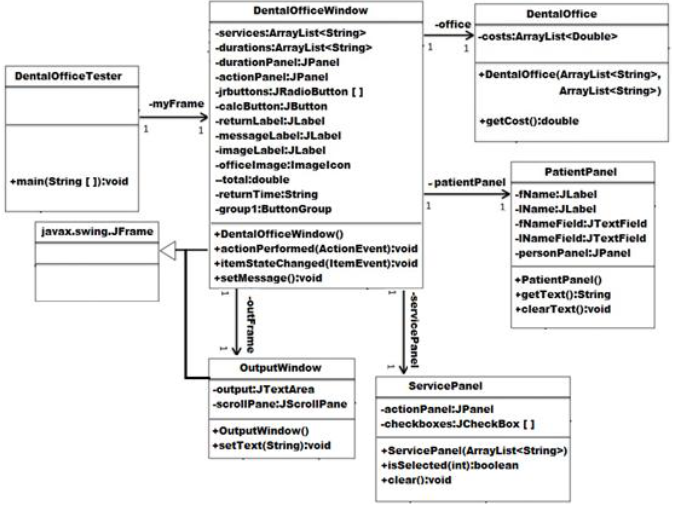
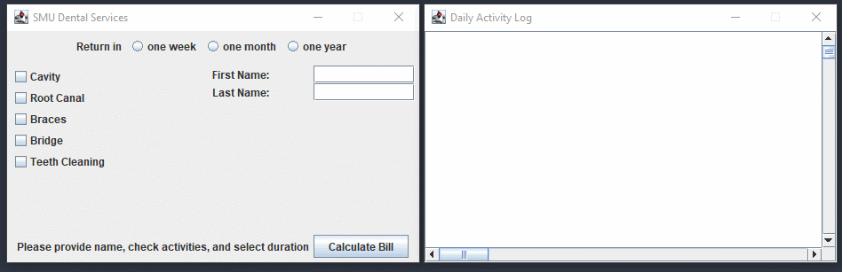

# lab-8

The objective of lab-8 is to get familiar with and utilize the wealth of Java GUI components available in Java Programming Language.
In this assignment we will create a simple GUI program to simulate a dental office.

This program should allow user to choose the type of dental services performed at the office, select the next appointment and calculate the total bill when the calculate button is clicked.

The Java APIs which we need to review prior to starting this lab are: JFrame, JPanel, JCheckBox, JRadioButton, JButton, JLabel, JImageIcon, ButtonGroup, BorderLayout, GridLayout, FlowLayout, ActionListener, ItemListener, File, ArrayList, FileNotFoundException

UML model:

Class: DentalOfficeTester

The main method should instantiate an object of the class DentalOfficeWindow. The size of the window should be at least 450x300 and should not be resizable.

Class: PatientPanel

This class will extend JPanel and it will consist of the first name and the last name fields. The methods getText will return the first and the last name ONLY when those names are populated otherwise it will return a null. The clearText method will clear the contents of the text field. This panel aggregates the GridLayout(2,1) to place the components on the panel.

Class: ServicePanel

This class will also extend JPanel containing check boxes to facilitate the services offered at the dental office. The method isSelected will return true or false depending upon the check box at the specific index was selected or not. The clear method will uncheck all the check boxes

Class: OutputWindow

This class will comprise of a ScrollPane containing an object of the JTextArea. The main function of this frame is to maintain the log of the activities at the dental office.

Class: DentalOffice

This class is responsible for servicing the DentalOfficeWindow class. Its primary task will be to communicate with the outside world such as reading the configuration files to determine what services are being offered by the Dental Office (services.cfg), durations available for the next visit (durations.cfg), costs per services offered (costs.cfg). The constructor will read the necessary files and will populate the specific array lists. The method getCost will return the cost of the specific services offered.

Hint: ArrayLists services and costs will be maintained as parallel arrays

Class: DentalOfficeWindow

This class is the main window which will extend JFrame and will implement ActionListener as well as ItemListener interfaces. The object of this class will comprise of several swing components along with objects of DentalOffice, ServicePanel, PatientPanel, and OutputWindow. The actionPerformed and itemStateChanged methods will send a message to the setMessage method to display the name, costs and the next visit duration. This class will also maintain the log of all the activities which will take during the execution of the dental office program. The internal panels durationPanel and actionPanel will aggregate FlowLayout and GridLayout(2, 1) respectively.

The components will be placed on the frame at the locations as below:

- ServicePanel -> WEST
- ImageLabel -> CENTER
- durationPanel -> NORTH
- actionPanel -> SOUTH
- PatientPanel -> EAST

Sample Run:

---

## Compile and Run

### DentalOfficeTester

    javac DentalOfficeTester.java
    java DentalOfficeTester
